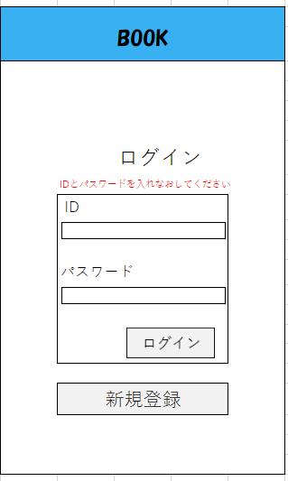

### 画面詳細図
## ログイン画面
*****

*****
## ログインページ
| ID | 項目名 | 内容 | アクション | イベント | 対応DB |
|----|------|-----|-----------|----------|--------|
|1   |ヘッダー|サイト名表示|-|-|-|
|2   |ログイン|テキスト画像|-|-|-|
|3   |id|入力欄varchar(50)|テキスト入力idはメールアドレス|-|〇|
|4   |パスワード|入力欄varchar(16)|半角英数字8文字以上16文字以下|テキスト入力|-|〇|
|5   |ログインボタン|ボタン|クリック|ログイン処理実行||
|6   |新規登録|ボタン|クリック|新規登録ページへ移る||
|7   |エラーメッセージを表示する|テキスト表示|エラーメッセージ表示|-|〇|

